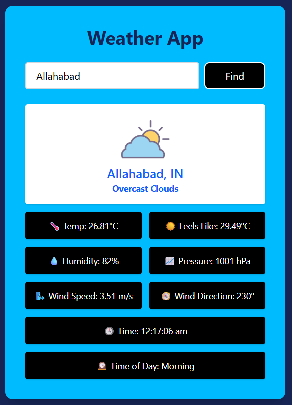

# 🌤️ Weather App

A clean and user-friendly weather forecast app that shows live weather details for any city.

## 🔧 Features

- 🌍 Search any city
- 🌦️ Shows weather condition (e.g., clouds, rain, clear)
- 🌡️ Temperature, feels-like
- 🧭 Country, state, wind, humidity, pressure
- 🕒 Real-time clock and part of day info

## 🛠️ Tech Stack

- **Frontend:** HTML, CSS, JavaScript (Deployed on **Netlify**)
- **Backend:** Node.js + Express (Deployed on **Render**)
- **APIs Used:**
  - OpenWeatherMap (weather data)
  - GeoDB Cities (suggestion – now removed)

## 🚀 Run Locally

1. Clone the repo  
   `git clone https://github.com/Gaura89744/WeatherApp.git`

2. Install backend dependencies  
   `cd backend && npm install`

3. Create `.env` in backend:

